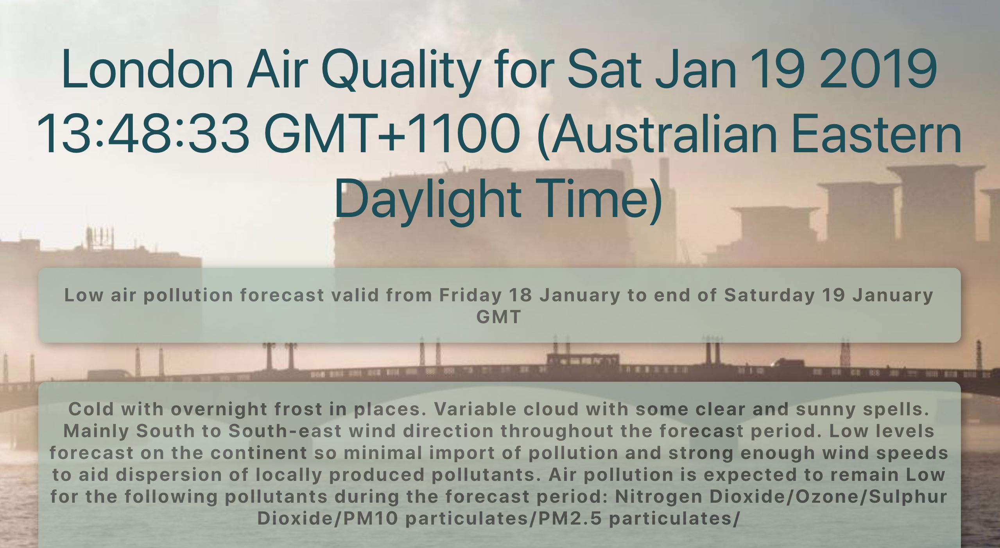

### Live website URL 

##### http://edge2travel-api.herokuapp.com

 

# Main Objective
Create any web app using the London Travel API.
## Website Objective
Display realtime London Air Quality 

## Overlay

My Website displays the current Airtime Quality Summary according to the London transport api. It includes a colour bar feature over the chemical pollutants which will display either Green(Low),Orange(Medium), or Red(High) for respective pollutant levels.

## Challenges

The London transport API Airquality endpoint returns a damaged .json file containing html data for a < br> which is diplayed as & gt;& lt;br/& gt;
 Thus this is displayed when that endpoint is called. Render unclean looking text. To solved this I used the .replace function built into Javascript to remove this useless text.
 
 

Author: Sam Ludwig